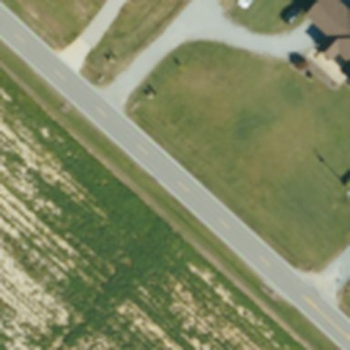

# Unwatched Roads

**Which North Carolina roads will fail next, including the ones nobody inspects.**

Built at the NC State hackathon, October 3–4, 2026.

## Most roads have no one watching them

Potholes and washed-out roads share a cause: water that does not drain. The places that know which roads are in trouble are the places that get inspected, and that is a small share of the map.

- **The state inspects its own roads.** NCDOT rates each stretch from 0 to 100. That covers 112,443 stretches, about 80,000 miles, in all 100 counties.
- **City streets have no public ratings.** Cities do not publish inspections the way the state does.
- **Cameras see very little.** NCDOT has about 1,150 traffic cameras, mostly on interstates.

Our idea: learn from the inspected roads what age, traffic and the shape of the land do to pavement, then score roads that have no rating. So far the model scores state roads. City streets are the goal.

## Follow one road through the model

State Road 2748 in Wake County is a two-lane road that runs 1.7 miles between SR 2755 and SR 1006. Every number below is this road's real record.

**1. What the state recorded.** Inspectors rated it 73.4 out of 100 in 2025. It was last resurfaced in 2010 with a thin layer of asphalt, and it carries about 1,600 vehicles a day. Below 60, the state calls a road Poor.

**2. How fast it is wearing out.** A new surface starts at 100. This one lost 26.6 points in the 15 years between resurfacing and inspection:

```
(100 − 73.4) ÷ 15 years = 1.77 points a year
```

The typical state road loses 1.25 a year, so this one is wearing faster than most. This wear rate is the first thing the model learns to predict.

**3. The land around it.** From the national elevation map we read where the road sits: 96 metres above sea level, nearly flat (a 1.3% slope), and 16 metres above the lowest ground nearby. Low, flat ground holds water. Water under pavement breaks it, and water over pavement closes the road.

**4. The view from above.** We cut one aerial photo for each road: a square 77 metres across, from the 2022 federal survey. We are testing whether the model can read anything useful in these. So far the photos have not improved the predictions.



**5. The prediction, made without seeing the answer.** We split the state into 5 km squares. The model that scored this road was trained without this road or any other road in its square, so it could not copy from a neighbour.

| | Prediction | What actually happened |
|---|---|---|
| Wear | 1.62 points a year | 1.77 points a year |
| Reaches Poor | in about 8 years (13.4 points left, at 1.62 a year) | not known yet |
| Cracking risk | in the top 13% of all roads | the 2025 inspection found cracking on more than 10% of it |

## Does it work?

We tested every prediction the same way as the road above: on roads the model had not seen. The table compares two versions of the model against using no model at all.

| Measure | No model | Inspection record and traffic | Adding the shape of the land |
|---|---|---|---|
| Wear rate: typical miss, in rating points a year (lower is better) | 0.965 | 0.753 | 0.749 |
| Cracking: how well it ranks cracked roads first, 0 to 1 (higher is better) | 0.158 | 0.377 | 0.422 |
| Helene damage: of the 50 roads ranked riskiest in the storm zone, how many were damaged | about 2 | 13 | 18 |

"No model" means giving every road the same guess, or picking roads at random.

Knowing the shape of the land barely changes the wear estimate. It clearly helps find cracked roads, and it helps most with flood damage.

## What is being built right now

Status on October 3, 2026.

| Track | Status | What it is |
|---|---|---|
| Corrected labels and honest map predictions | Done | Age is counted to the inspection year, a road counts as cracked only above 10%, and every road's score on the map comes from a model that never saw that road. 89 tests guard it. |
| Do the aerial photos help? | Code written, not yet run | A test on all 112,443 photos: one view of each against eight turned and flipped views, and training with and without those changes. |
| Real pothole evidence | Planned | 24,824 pothole reports from Charlotte and 435 from Raleigh, matched to roads, to check whether the roads we rank worst get more reports. Plus still images from public NCDOT cameras. |
| Flood depth from cameras | Collecting photos | Photos of flooded coastal roads from late September 2026, each with a measured water level, to teach a model to read how deep the water is. |

## What we cannot claim

- **It is one snapshot.** The state publishes one inspection per road, with no history. Wear per year is rating lost divided by age, not a measured trend.
- **Flood risk comes from one storm.** The model learned what Helene damaged in western North Carolina. Another storm could behave differently.
- **City streets are not scored yet.** Only state roads have ratings to learn from, so a city-street score would be borrowed from state roads and could not be checked the same way.
- **Traffic counts are thin.** About 48% of roads have a real count.
- **The photos are older than the inspections.** They are from 2022; most inspections are from 2025.

The technical detail behind each of these is in [Limitations](#limitations) below.

Data: NCDOT Pavement Condition Survey, USGS 3DEP elevation, USDA NAIP 2022 aerial imagery, and Hurricane Helene damage records from NCDOT, the NC Geological Survey and USGS.

---

## Measured results

5-fold spatial block CV on a 5 km grid. A segment's block is the 5 km square its midpoint falls in, and a block's fold is a hash of its id, so folds do not change when segments are added. Flood is scored only inside `in_helene_zone` (P@50 / AUC-PR).
Wear rate is rating points lost per year, with pavement age counted to the survey year (2 to 40 years).
Cracking target is moderate plus high alligator cracking above 10% (prevalence 15.8% of labelled segments, so chance AUC-PR is about 0.16).

**All labelled segments (77,422 with a rate label)**

| Model | Rate MAE | Rate Spearman | Cracking AUC-PR | Flood P@50 / AUC-PR |
|---|---|---|---|---|
| Do-nothing reference (median rate, prevalence) | 0.965 | n/a | 0.158 | n/a / 0.039 |
| LightGBM, pavement + traffic (baseline) | 0.753 | 0.573 | 0.377 | 0.26 / 0.106 |
| + terrain | 0.749 | 0.586 | 0.422 | 0.36 / 0.207 |

**Imagery subset (8,534 segments with chips and a rate label; compare only within this block)**

Measured on 2026-10-03 before the label fix, when age was counted to 2025 and cracking meant any moderate or high cracking (41% prevalence overall, 34% on this subset). These rows are not comparable with the table above. Rerunning them needs `data/processed/vit_frozen.parquet`, which is not in the repo; the original rows are in `docs/ablation_final.csv` at commit `5c07f7c`.

| Model | Rate MAE | Rate Spearman | Cracking AUC-PR | Flood P@50 / AUC-PR |
|---|---|---|---|---|
| baseline | 0.732 | 0.584 | 0.650 | n/a (14 segments) |
| + terrain | 0.736 | 0.585 | 0.643 | n/a (14 segments) |
| + frozen DINOv2 embedding (PCA 16) | 0.746 | 0.587 | 0.663 | n/a (14 segments) |

Not run in the time available: weather features, spatial lags, fine-tuned ViT-S. The frozen embedding showed no reliable lift on the subset.

## Reproducing

```
uv run python -m src.pipeline.features          # data/processed/segments.parquet
uv run python -m src.pipeline.terrain_simple    # data/processed/terrain.parquet
uv run python -m src.model.train_tabular        # targets, folds, ablation.csv
uv run python -m src.model.final_ablation       # ablation_final.csv, predictions, handoff/predictions_geo.parquet
uv run pytest -q                                # real-data tests are skipped where the data is absent
```

Targets, folds, feature lists and the out-of-fold loop live in `src/model/common.py`; the scripts import them. Model inputs are checked against a banned list (the rating, the other condition measurements and distress codes from the same survey, the recommended treatment, and anything that is a label or a prediction), so a leaking column cannot be added by accident.

## Limitations

- **AADT coverage is partial.** Only about 48% of segments have a real traffic count. NCDOT survey values of exactly 550 and 5500 look like placeholder defaults and were removed.
- **Terrain is partly a proxy.** The terrain row uses every `tn_` column present. `terrain_simple.py` gives `tn_elev`, `tn_slope`, `tn_relief1k` and `tn_hand_proxy` (height above the local minimum within about 500 m, not true HAND) from numpy on the 30 m DEM. Where `dem.py` has produced its rasters, `features.py` also samples `tn_elev_d8`, `tn_slope_d8` and `tn_flowacc` at the segment midpoint; flow accumulation is computed in tiles, so large rivers are undercounted. The table above used all seven. The imagery-subset rows used only the first four, because pysheds failed on that machine (numba error).
- **Imagery was evaluated on a random sample.** Only about 11.5k chips were cut (stopped early for time). Just 14 chipped segments fall in the Helene zone, so imagery was not tested for flood. The PCA that reduces the embeddings was fitted on all chips, held-out ones included (no labels are involved).
- **`train_vit.py` is not seeded.** Flips draw from the global NumPy generator inside DataLoader workers and no seed is set, so a fine-tuning run cannot be reproduced exactly. Its out-of-fold scores (`im_vit_*`) are banned as tabular inputs until they are generated per outer fold.
- **Map predictions are held-out where a label exists.** In `handoff/predictions_geo.parquet`, a segment the model was trained on carries its out-of-fold prediction; `rate_heldout`, `crack_heldout` and `flood_heldout` say which values those are. Every other segment gets the model fitted on all labelled segments. Flood scores are meaningful only where `in_helene_zone == 1`.
- **Rate predictions without a resurfacing year are extrapolations.** 22,948 segments have no `YEAR_LAST_REHAB`, so they have no age and no rate label; the model never trained on a segment like them.
- **No years-to-Poor where the rating is out of date.** 1,640 segments were resurfaced after their survey, so their rating describes the old surface. `pred_years_to_poor` is blank for them, and for the 3 segments with a rating of 0. Another 4,856 segments were surveyed in the same year they were resurfaced; they keep a forecast, which may rest on a rating taken before the work.
- **Segment geometry in the map file is simplified to 3 m** to keep the tracked file near 19 MB.
